# Network Reconnaissance and Traffic Analysis Lab

Enumerated an unfamiliar subnet with Nmap, then analyzed a packet capture from the same network and found an active reconnaissance campaign already in progress. Reconstructed the attacker's sequence from ARP sweep through service-specific enumeration, and identified an anonymous LDAP bind succeeding against the domain controller.

**Tools:** Nmap 7.91, Zenmap, Wireshark

---

## Part 1 — Enumeration

```
nmap -sV -T4 -O -F --version-light 10.168.27.0/24
```

256 addresses scanned, 6 hosts up, 38.81 seconds.

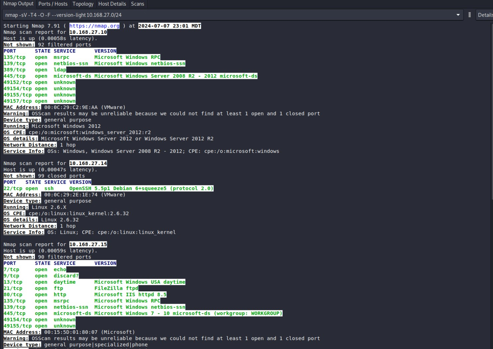
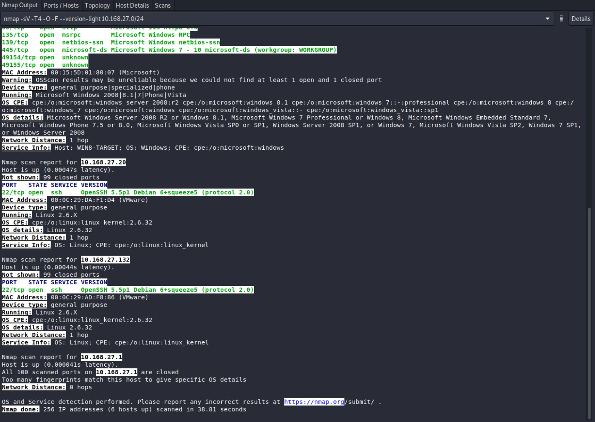

| Host | Open Ports | Services | OS |
|------|-----------|----------|-----|
| 10.168.27.1 | none (100 closed) | — | unidentified |
| 10.168.27.10 | 135, 139, **389**, 445, 49152–49157 | msrpc, netbios-ssn, **ldap**, microsoft-ds | Windows Server 2012 / 2012 R2 |
| 10.168.27.14 | 22 | OpenSSH 5.5p1 Debian | Linux 2.6.32 |
| 10.168.27.15 | **7, 9, 13**, 21, 80, 135, 139, 445, 49154–49155 | echo, discard, daytime, FileZilla ftpd, IIS 8.5 | Windows Server 2008 R2 / 8.1 |
| 10.168.27.20 | 22 | OpenSSH 5.5p1 Debian | Linux 2.6.32 |
| 10.168.27.132 | 22 | OpenSSH 5.5p1 Debian | Linux 2.6.32 |

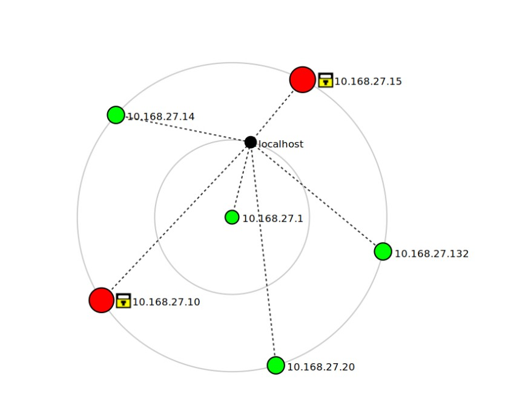

**Port 389 identifies 10.168.27.10 as the domain controller.** That host became the focus of the capture analysis.

**Ports 7, 9, and 13 on 10.168.27.15** are echo, discard, and daytime — obsolete diagnostic services with no modern purpose. They expand attack surface for no benefit and should be disabled.

---

## Part 2 — Traffic Analysis

The capture was taken from the same network. A single external host, **10.16.80.243**, appears throughout it.

### Stage 1: ARP sweep

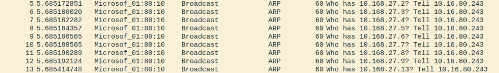

Sequential ARP requests — .2, .3, .4, .5, .6, .7, .8, .9, .13 — every one "Tell 10.16.80.243." Normal ARP is sparse and driven by actual traffic. Sequential enumeration of an entire address range is a scan.

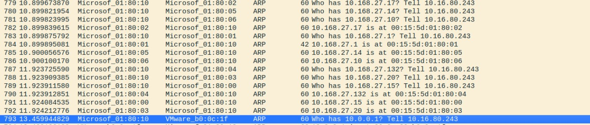

The sweep succeeded. The host collected live addresses and their MAC addresses, then probed 10.0.0.1, testing whether anything existed outside the local subnet.

### Stage 2: TCP SYN port scan

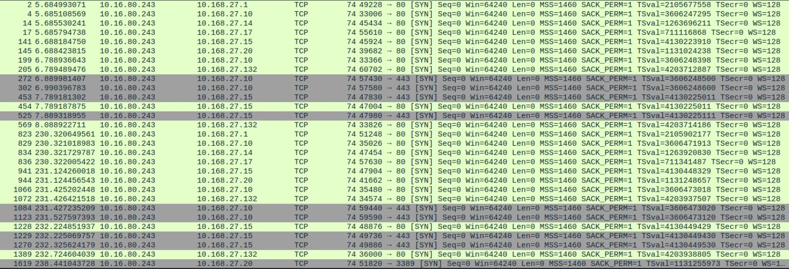
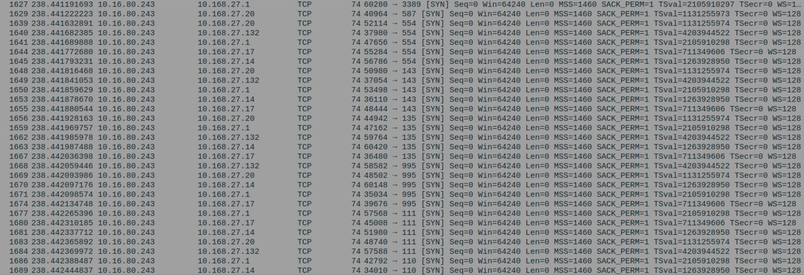

One SYN per port, per host, across every address the ARP sweep confirmed. Ports probed included 22, 23, 25, 53, 80, 110, 111, 135, 139, 143, 256, 443, 445, 554, 587, 993, 995, 1720, 3306, 3389, and 8888.

The pattern matters. A denial-of-service floods one port. This is one packet at many ports — service discovery.

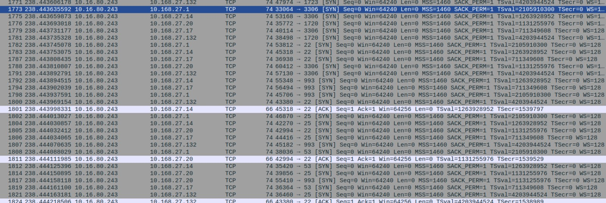
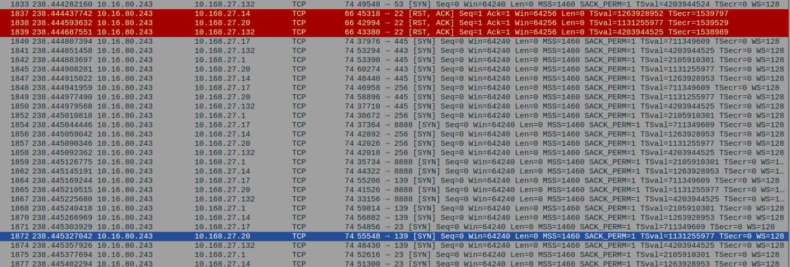

RST,ACK responses on port 22 from three hosts confirm those ports were closed. The scan was gathering an accurate service map.

### Stage 3: Service-specific enumeration

Once the port scan identified what was running, the same source moved to protocol-level probing.

**HTTP against the domain controller**

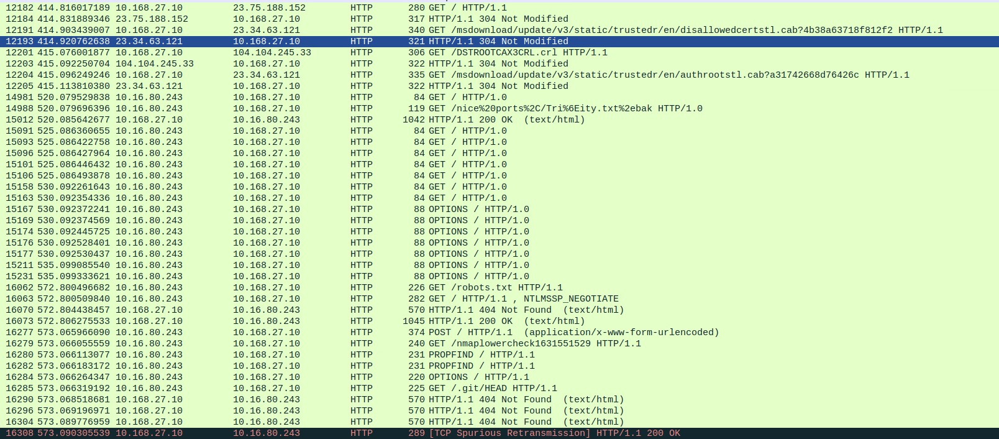

Requests for `/robots.txt`, `/.git/HEAD` (exposed repository hunting), `/HNAP1` (router exploit probe), `POST /sdk` and `/evox/about` (VMware vSphere fingerprinting), and hundreds of OPTIONS requests testing allowed methods.

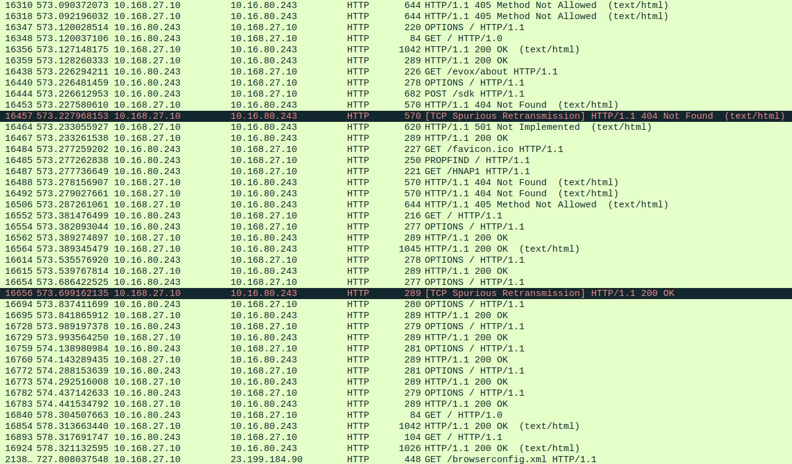

PROPFIND requests test for WebDAV. The 405 and 501 responses tell the scanner which methods the server rejects, which is itself useful information.

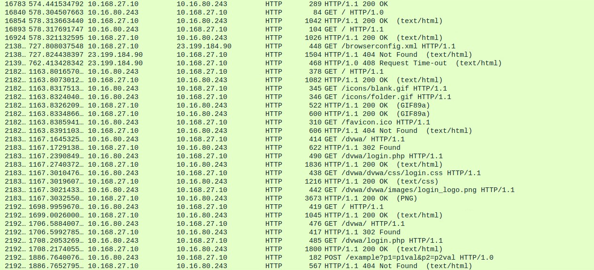

The scanner located `/dvwa/login.php` and pulled the login page, CSS, and images. Damn Vulnerable Web Application is a deliberately insecure training target — its presence on a production-facing host is a finding on its own.

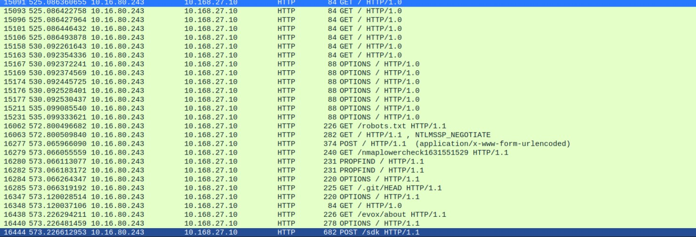

`GET /nmaplowercheck1631551529` confirms the tool. That string is Nmap's HTTP fingerprinting probe, which sends a randomized path to see how the server responds to unknown URIs.

**LDAP — the significant finding**

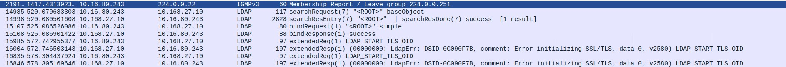

Three things in this capture:

1. `searchRequest "<ROOT>" baseObject` returning `searchResDone success` — directory information disclosed to an unauthenticated query
2. `bindRequest "<ROOT>" simple` followed by **`bindResponse success`** — **anonymous bind accepted by the domain controller**
3. `extendedReq LDAP_START_TLS_OID` returning `LdapErr: DSID-0C090F7B, Error initializing SSL/TLS` — **StartTLS unavailable, so LDAP traffic is unencrypted**

An anonymous bind against a domain controller lets an attacker enumerate the directory — users, groups, computers, organizational structure — without credentials. That is the target list for everything that comes next.

**SMB**

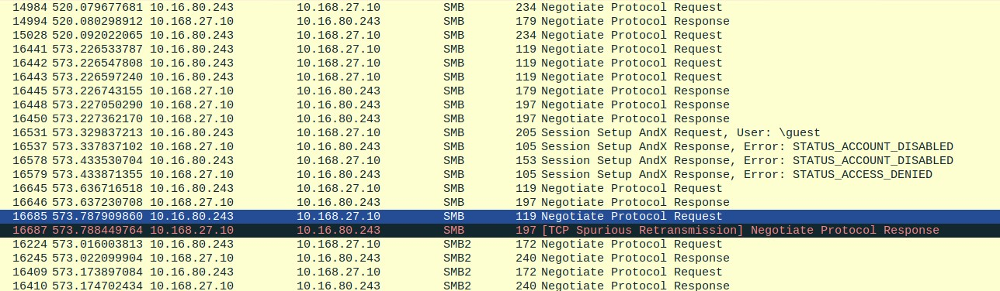

`Session Setup AndX Request, User: \guest` returning `STATUS_ACCOUNT_DISABLED` and `STATUS_ACCESS_DENIED`. Guest access was correctly disabled. The attempt itself is the indicator.

**MySQL**

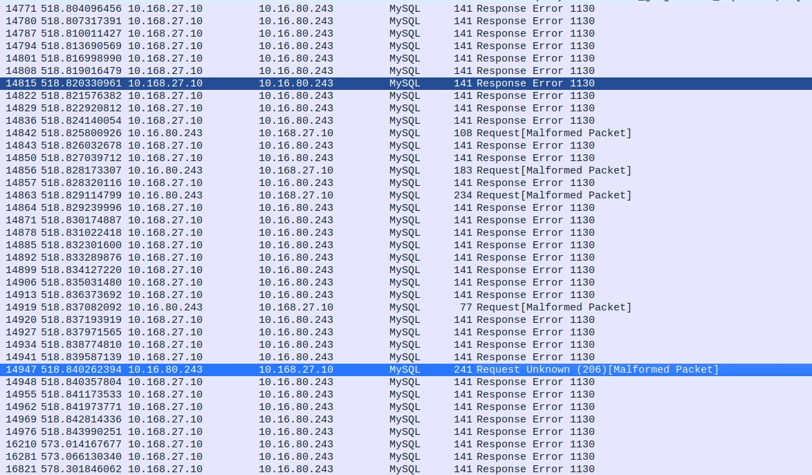

Hundreds of `Response Error 1130` — host not permitted to connect — interleaved with malformed request packets. Access control held, but the volume shows sustained attempts, and the malformed packets suggest protocol fuzzing rather than ordinary connection failures.

### Cleartext FTP exposure

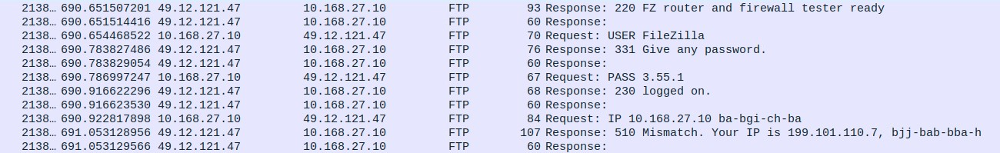

This exchange is between 10.168.27.10 and an external host at 49.12.121.47, with the banner "FZ router and firewall tester ready." It is FileZilla Server's built-in NAT configuration test, not a user login — `USER FileZilla` and `PASS 3.55.1` are the tool name and version string.

It still matters. The exchange crosses the network in cleartext and discloses both the internal address (10.168.27.10) and the external address (199.101.110.7) in the response. Any FTP session on this host, including real authentication, would be equally readable.

---

## The Attack Chain

Read in order, the capture describes a methodical progression:

**ARP sweep** → live hosts and MAC addresses
**TCP SYN scan** → open ports on each confirmed host
**Protocol enumeration** → HTTP paths and methods, SMB guest access, LDAP directory queries, MySQL connections
**Anonymous LDAP bind succeeds** → directory contents available without credentials

Each stage consumed the output of the previous one. Any single finding reads as background noise on a busy network. The sequence, all from one source address, is a reconnaissance campaign.

---

## Findings and Recommendations

| Finding | Severity | Recommendation |
|---------|----------|----------------|
| **Anonymous LDAP bind permitted on DC** | Critical | Disable anonymous bind; require authentication for directory queries |
| **LDAP StartTLS unavailable** | High | Enable LDAPS; directory traffic is currently readable in transit |
| **DVWA reachable on the network** | High | Remove; a deliberately vulnerable application should not be network-accessible |
| Active reconnaissance undetected | High | ARP sweeps and sequential SYN scans are trivially detectable; nothing was watching |
| Cleartext FTP | Medium | Disable plain FTP, require FTPS or SFTP |
| Cleartext HTTP on port 80 | Medium | Redirect to HTTPS, disable port 80 |
| OpenSSH 5.5p1, default configuration | Medium | Patch; key-based auth, source restriction, rate limiting |
| Legacy services (echo, discard, daytime) | Low | Disable ports 7, 9, 13 |
| Windows Server 2008 R2 in service | Medium | Unsupported since January 2020; plan migration |

---

## What I Took From This

I initially read the TCP traffic as a denial-of-service attack because the volume was high and it came from one source. It was a port scan. The distinction is the distribution: a flood concentrates on one port, a scan spreads one packet across many. Getting that wrong would have sent the response in the wrong direction entirely.

The LDAP capture was the one that mattered and the one easiest to scroll past. Four packets in a capture with tens of thousands. `bindResponse success` on an anonymous request against a domain controller is the finding that makes everything else in the chain workable for an attacker.

The habit worth keeping: when something looks anomalous, pivot on the source address and see everywhere else it appears. Reading these findings independently produces a list of medium-severity tickets. Reading them as one actor's sequence produces an incident.

---

## References

- Chappell, L. (2017). *Wireshark Network Analysis* (2nd ed.). Wiley.
- Microsoft. [Introduction to LDAP channel binding and LDAP signing](https://learn.microsoft.com/en-us/troubleshoot/windows-server/active-directory/enable-ldap-signing-in-windows-server)
- NIST. [NISTIR 7966: Security of Interactive and Automated Access Management Using Secure Shell (SSH)](https://nvlpubs.nist.gov/nistpubs/ir/2015/NIST.IR.7966.pdf)
- NIST. [SP 800-61 Rev. 2: Computer Security Incident Handling Guide](https://nvlpubs.nist.gov/nistpubs/SpecialPublications/NIST.SP.800-61r2.pdf)
- Nmap. [Service and Version Detection](https://nmap.org/book/vscan.html)
